# Snapshots + transcript, 1:55:00 - 2:25:00

One frame every 10 s. The text under each frame is what was said from that
frame until the next one, from YouTube's auto-caption track (word-level
timings, not a re-transcription - see README.md).

### [01:55:00](https://www.youtube.com/live/ArJaMXTIXgY?t=6900)

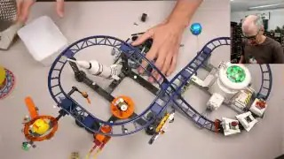

and we're going to try so the way I have envisioned this is that we're going to mount some Wheels on the side of the tracks

### [01:55:10](https://www.youtube.com/live/ArJaMXTIXgY?t=6910)

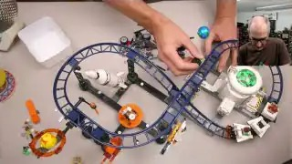

similar to how they did in the first roller coaster the first roller coaster has the the chain that brings the roller coaster up but then at the top it uses some Wheels

### [01:55:20](https://www.youtube.com/live/ArJaMXTIXgY?t=6920)

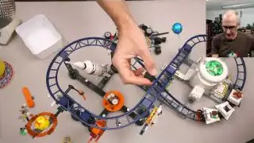

to basically push it around the curves so we're going to do something similar we're going to have uh

### [01:55:30](https://www.youtube.com/live/ArJaMXTIXgY?t=6930)

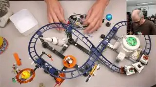

some Wheels mounted on the top and I think we

### [01:55:40](https://www.youtube.com/live/ArJaMXTIXgY?t=6940)

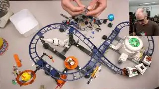

will have two of them I do have a prototype already built here oh I just lost the piece

### [01:55:50](https://www.youtube.com/live/ArJaMXTIXgY?t=6950)

and we got some Motors and a battery

### [01:56:00](https://www.youtube.com/live/ArJaMXTIXgY?t=6960)

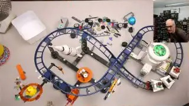

box motor battery

### [01:56:10](https://www.youtube.com/live/ArJaMXTIXgY?t=6970)

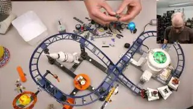

box and I'm using these new flip-flop Technic gears which are Super super awesome

### [01:56:20](https://www.youtube.com/live/ArJaMXTIXgY?t=6980)

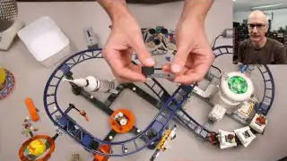

actually uh I think they're uh going to be Game Changer in terms of building like compact

### [01:56:30](https://www.youtube.com/live/ArJaMXTIXgY?t=6990)

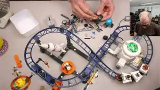

mechanisms so I think the way I want to do this the way I had the Prototype I actually want two wheels mounted on the side and I'm going to actually

### [01:56:40](https://www.youtube.com/live/ArJaMXTIXgY?t=7000)

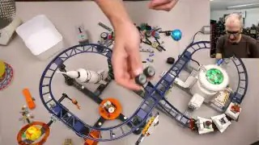

have two of these connect together to drive

### [01:56:50](https://www.youtube.com/live/ArJaMXTIXgY?t=7010)

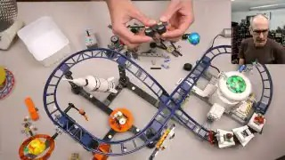

so we need a way to drive these obviously and so we're going to

### [01:57:00](https://www.youtube.com/live/ArJaMXTIXgY?t=7020)

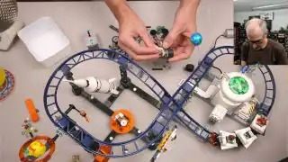

put some double bubble gears mounted like

### [01:57:10](https://www.youtube.com/live/ArJaMXTIXgY?t=7030)

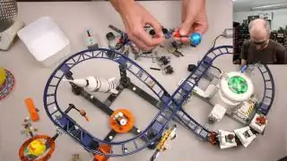

so so we're going to go like so

### [01:57:20](https://www.youtube.com/live/ArJaMXTIXgY?t=7040)

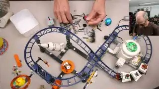

and we're actually just going to tack these in like that that way I can drive

### [01:57:30](https://www.youtube.com/live/ArJaMXTIXgY?t=7050)

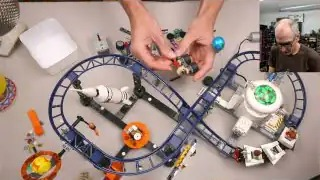

and then we'll put another one obviously actually let's just make this all

### [01:57:40](https://www.youtube.com/live/ArJaMXTIXgY?t=7060)

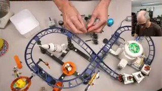

color coordinated put black one and then we need another

### [01:57:50](https://www.youtube.com/live/ArJaMXTIXgY?t=7070)

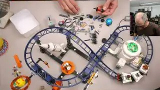

you know I took all these pieces out but oh there's

### [01:58:00](https://www.youtube.com/live/ArJaMXTIXgY?t=7080)

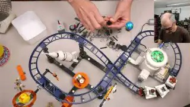

one

### [01:58:10](https://www.youtube.com/live/ArJaMXTIXgY?t=7090)

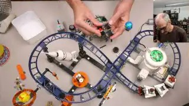

okay so now I have a single Drive drive

### [01:58:20](https://www.youtube.com/live/ArJaMXTIXgY?t=7100)

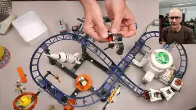

axle that drives both of those wheels so we're just going to have to we're going to mount this on the side of the track here and to do that

### [01:58:30](https://www.youtube.com/live/ArJaMXTIXgY?t=7110)

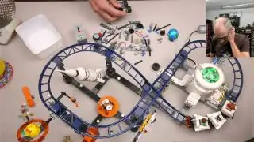

I'm actually going to use the bars that run in the middle of the track and we're just going to clip we're going to use these uh little Clips with a bar on them

### [01:58:40](https://www.youtube.com/live/ArJaMXTIXgY?t=7120)

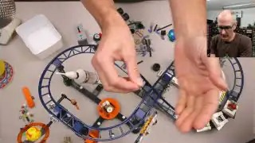

to clip clip it to the track we're just going

### [01:58:50](https://www.youtube.com/live/ArJaMXTIXgY?t=7130)

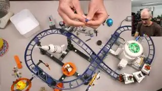

to stick that in a technic connector we're going to put the Clips in so that way I can clip this Technic

### [01:59:00](https://www.youtube.com/live/ArJaMXTIXgY?t=7140)

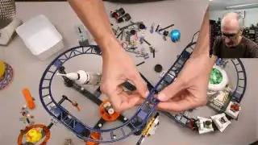

connector to the bottom of the track and then we can mount whatever we want to to the track itself and it shouldn't interfere with the coaster actually

### [01:59:10](https://www.youtube.com/live/ArJaMXTIXgY?t=7150)

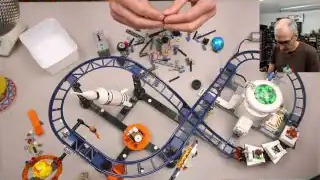

operating um so we'll make another one of those

### [01:59:20](https://www.youtube.com/live/ArJaMXTIXgY?t=7160)

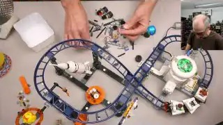

and then we'll connect them together with a relatively long

### [01:59:30](https://www.youtube.com/live/ArJaMXTIXgY?t=7170)

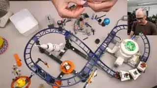

axle so now I can clip it to basically because I have these mounted on an axle I can adjust the length of them to suit

### [01:59:40](https://www.youtube.com/live/ArJaMXTIXgY?t=7180)

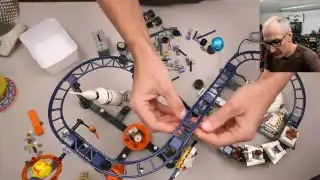

the distance between the crossbars on the track so there we have a super it's actually quite a Sol

### [01:59:50](https://www.youtube.com/live/ArJaMXTIXgY?t=7190)

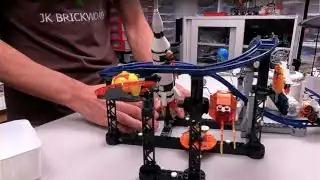

ID oh man I pulled a lot of these pieces out it's quite a solid colle connection to the track just from underneath

### [02:00:00](https://www.youtube.com/live/ArJaMXTIXgY?t=7200)

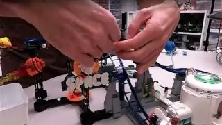

and uh you can actually Mount this to because it's got a sliding cuz these connectors are mounted on a sliding axle we can sh vary the

### [02:00:10](https://www.youtube.com/live/ArJaMXTIXgY?t=7210)

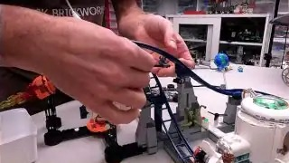

distance between them so we can actually mount it to any track piece uh The Straits either of these uh large

### [02:00:20](https://www.youtube.com/live/ArJaMXTIXgY?t=7220)

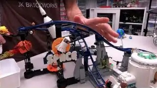

slopes the small slopes and uh I think we'll obviously probably have to figure out a way to connect them to the curved slopes

### [02:00:30](https://www.youtube.com/live/ArJaMXTIXgY?t=7230)

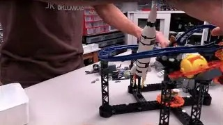

as well but uh I don't think that should be too much of a problem okay uh but

### [02:00:40](https://www.youtube.com/live/ArJaMXTIXgY?t=7240)

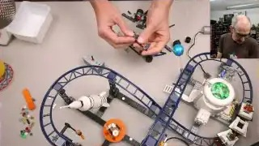

now we need to somehow Mount that as well so more Technic connectors we're just going to slide these

### [02:00:50](https://www.youtube.com/live/ArJaMXTIXgY?t=7250)

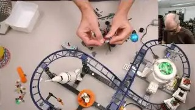

on actually I'm going to sit this one in

### [02:01:00](https://www.youtube.com/live/ArJaMXTIXgY?t=7260)

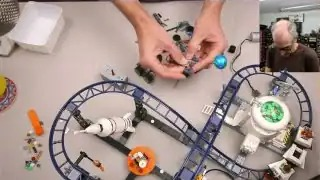

_(no speech)_

### [02:01:10](https://www.youtube.com/live/ArJaMXTIXgY?t=7270)

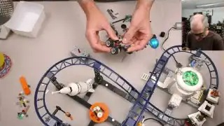

there and I want this I don't want this to be rigidly mounted so I'm actually sliding these wheels on these

### [02:01:20](https://www.youtube.com/live/ArJaMXTIXgY?t=7280)

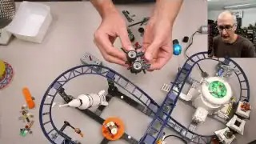

axles and I'm going to stick a rubber band to pull them in so that way when the

### [02:01:30](https://www.youtube.com/live/ArJaMXTIXgY?t=7290)

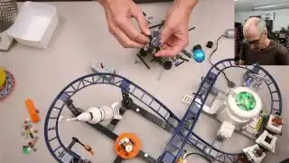

when the roller coaster comes by it can actually uh it'll it needs to like

### [02:01:40](https://www.youtube.com/live/ArJaMXTIXgY?t=7300)

basically have some flexibility in the movement so that it doesn't bind uh so we're just going to stick a rubber band on it like so

### [02:01:50](https://www.youtube.com/live/ArJaMXTIXgY?t=7310)

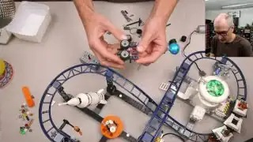

so now we have this basically spring-loaded set of Drive wheels that we can mount beside the roller coaster

### [02:02:00](https://www.youtube.com/live/ArJaMXTIXgY?t=7320)

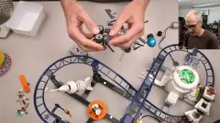

track and I think that's pretty much it for this one I'm

### [02:02:10](https://www.youtube.com/live/ArJaMXTIXgY?t=7330)

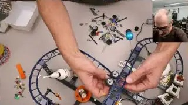

going to mount this on so

### [02:02:20](https://www.youtube.com/live/ArJaMXTIXgY?t=7340)

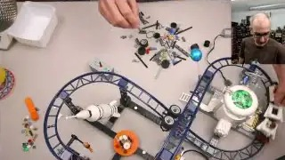

now in theory when the roller coaster comes up you can see how it like turns the wheels but if I'm actually driving

### [02:02:30](https://www.youtube.com/live/ArJaMXTIXgY?t=7350)

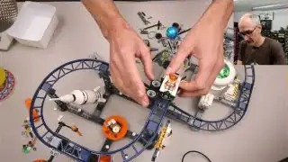

these wheels it should lift the coaster up now this coaster actually might be too heavy in my testing I was only using empty

### [02:02:40](https://www.youtube.com/live/ArJaMXTIXgY?t=7360)

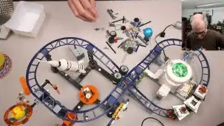

coasters and this thing is actually quite heavy so we'll see it might not work at all oh and actually her head gets in the way very interesting I might have to mount

### [02:02:50](https://www.youtube.com/live/ArJaMXTIXgY?t=7370)

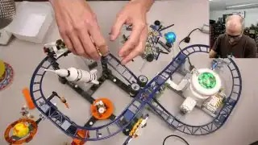

it on the other side so there's clearance which we can definitely

### [02:03:00](https://www.youtube.com/live/ArJaMXTIXgY?t=7380)

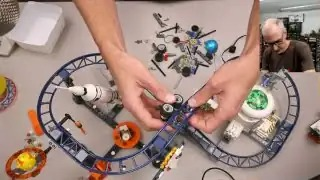

do shouldn't be a

### [02:03:10](https://www.youtube.com/live/ArJaMXTIXgY?t=7390)

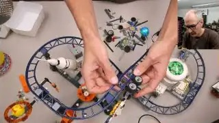

problem and then we should have some clearance

### [02:03:20](https://www.youtube.com/live/ArJaMXTIXgY?t=7400)

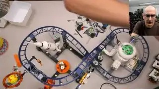

_(no speech)_

### [02:03:30](https://www.youtube.com/live/ArJaMXTIXgY?t=7410)

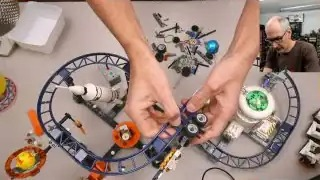

okay uh now we need to make another one of those actually we're going to need to make a few might need to make more

### [02:03:40](https://www.youtube.com/live/ArJaMXTIXgY?t=7420)

than more than a few

### [02:03:50](https://www.youtube.com/live/ArJaMXTIXgY?t=7430)

we're going to need at least three because we'll probably need one on this section of track one on this section of track and then one on this section

### [02:04:00](https://www.youtube.com/live/ArJaMXTIXgY?t=7440)

of track so I'm just going to put a bunch together I think I have enough I think I pull enough pieces out to

### [02:04:10](https://www.youtube.com/live/ArJaMXTIXgY?t=7450)

make three of them or four of them I have uh one prototype already bu built

### [02:04:20](https://www.youtube.com/live/ArJaMXTIXgY?t=7460)

so but now that I know how this goes together should be pretty uh

### [02:04:30](https://www.youtube.com/live/ArJaMXTIXgY?t=7470)

_(no speech)_

### [02:04:40](https://www.youtube.com/live/ArJaMXTIXgY?t=7480)

quick kind of doing this just based on memory but uh when first starting with an idea do you

### [02:04:50](https://www.youtube.com/live/ArJaMXTIXgY?t=7490)

prototype just by taking Parts in building or do you do anything electronically first no it's all just mostly I'd say

### [02:05:00](https://www.youtube.com/live/ArJaMXTIXgY?t=7500)

90 9% of the time I always start with real bricks and I just figure out

### [02:05:10](https://www.youtube.com/live/ArJaMXTIXgY?t=7510)

how to put them together yeah I just prototype with real bricks

### [02:05:20](https://www.youtube.com/live/ArJaMXTIXgY?t=7520)

it's definitely the way I prefer to

### [02:05:30](https://www.youtube.com/live/ArJaMXTIXgY?t=7530)

build

### [02:05:40](https://www.youtube.com/live/ArJaMXTIXgY?t=7540)

okay we need to make the drives train again uh maybe mount it on the other side to avoid collision with train below yeah since the gears

### [02:05:50](https://www.youtube.com/live/ArJaMXTIXgY?t=7550)

are hanging too low yes great minds think alike indeed

### [02:06:00](https://www.youtube.com/live/ArJaMXTIXgY?t=7560)

that is what we have done okay uh

### [02:06:10](https://www.youtube.com/live/ArJaMXTIXgY?t=7570)

actually I don't know if I have enough of that part

### [02:06:20](https://www.youtube.com/live/ArJaMXTIXgY?t=7580)

all right there number two oh yeah we

### [02:06:30](https://www.youtube.com/live/ArJaMXTIXgY?t=7590)

do do some Mi mix and match the colors but that's

### [02:06:40](https://www.youtube.com/live/ArJaMXTIXgY?t=7600)

fine

### [02:06:50](https://www.youtube.com/live/ArJaMXTIXgY?t=7610)

_(no speech)_

### [02:07:00](https://www.youtube.com/live/ArJaMXTIXgY?t=7620)

okay actually one of

### [02:07:10](https://www.youtube.com/live/ArJaMXTIXgY?t=7630)

these actually I'm just going to put two together for now for the for the Straits

### [02:07:20](https://www.youtube.com/live/ArJaMXTIXgY?t=7640)

[Music] which way do I want this to

### [02:07:30](https://www.youtube.com/live/ArJaMXTIXgY?t=7650)

go this

### [02:07:40](https://www.youtube.com/live/ArJaMXTIXgY?t=7660)

way I need more half p

### [02:07:50](https://www.youtube.com/live/ArJaMXTIXgY?t=7670)

_(no speech)_

### [02:08:00](https://www.youtube.com/live/ArJaMXTIXgY?t=7680)

riveting entertainment here do I have a mechanical engineering degree or is it

### [02:08:10](https://www.youtube.com/live/ArJaMXTIXgY?t=7690)

just experience uh I do have an engineering degree it's uh not mechanical though okay uh

### [02:08:20](https://www.youtube.com/live/ArJaMXTIXgY?t=7700)

basically all of this is just from experience and playing okay I'm going to mount these oh actually yeah I want those on the other

### [02:08:30](https://www.youtube.com/live/ArJaMXTIXgY?t=7710)

side I want to mount it on the other side M this one on the other side as well if there's

### [02:08:40](https://www.youtube.com/live/ArJaMXTIXgY?t=7720)

space yeah appears to be space and then we somehow need to motorize all

### [02:08:50](https://www.youtube.com/live/ArJaMXTIXgY?t=7730)

this and uh for that actually I'm going to

### [02:09:00](https://www.youtube.com/live/ArJaMXTIXgY?t=7740)

need to get a few more

### [02:09:10](https://www.youtube.com/live/ArJaMXTIXgY?t=7750)

pieces oh basically I'm going to try Mount

### [02:09:20](https://www.youtube.com/live/ArJaMXTIXgY?t=7760)

the motor directly onto the end of one of them so we can drive it give it a little direct drive action

### [02:09:30](https://www.youtube.com/live/ArJaMXTIXgY?t=7770)

um and there appears to be more room at top so I'm just going to take the top one off and we're going to stick a motor on it

### [02:09:40](https://www.youtube.com/live/ArJaMXTIXgY?t=7780)

somehow and for now I'm just going to tack on I'm just going to tack

### [02:09:50](https://www.youtube.com/live/ArJaMXTIXgY?t=7790)

on I'm going to tack on a motor

### [02:10:00](https://www.youtube.com/live/ArJaMXTIXgY?t=7800)

we're just going to tack on a lift arm to the end so we have something to actually connect the motor to

### [02:10:10](https://www.youtube.com/live/ArJaMXTIXgY?t=7810)

and we're actually going to need a longer axle which I anticipated so we'll get a five long axle we'll stick

### [02:10:20](https://www.youtube.com/live/ArJaMXTIXgY?t=7820)

this on so this way

### [02:10:30](https://www.youtube.com/live/ArJaMXTIXgY?t=7830)

basically I've just stuck another Technic connector on here so I can put a pin on it and then we can just stick the motor right on So in

### [02:10:40](https://www.youtube.com/live/ArJaMXTIXgY?t=7840)

theory we got our battery box stick it on we can just direct

### [02:10:50](https://www.youtube.com/live/ArJaMXTIXgY?t=7850)

drive this whole

### [02:11:00](https://www.youtube.com/live/ArJaMXTIXgY?t=7860)

thing let's see except it is on the other side will this fit down here actually

### [02:11:10](https://www.youtube.com/live/ArJaMXTIXgY?t=7870)

I think we'll put it on the bottom if we can will this all fit

### [02:11:20](https://www.youtube.com/live/ArJaMXTIXgY?t=7880)

it would be nicer if there wasn't a big motor sticking out the top

### [02:11:30](https://www.youtube.com/live/ArJaMXTIXgY?t=7890)

anyway well this slope is just a bit in the way so I'm actually going to take that

### [02:11:40](https://www.youtube.com/live/ArJaMXTIXgY?t=7900)

off for now okay so we have a motor

### [02:11:50](https://www.youtube.com/live/ArJaMXTIXgY?t=7910)

with one motorized it's hitting it's hitting the

### [02:12:00](https://www.youtube.com/live/ArJaMXTIXgY?t=7920)

alien okay there we go so now in theory we got one motor in theory

### [02:12:10](https://www.youtube.com/live/ArJaMXTIXgY?t=7930)

when this comes up here oh it's going the wrong way oh yeah it pushes pushes the coaster

### [02:12:20](https://www.youtube.com/live/ArJaMXTIXgY?t=7940)

up which is good but obviously we need to need to motorize the other section as

### [02:12:30](https://www.youtube.com/live/ArJaMXTIXgY?t=7950)

well I love your GBC modules I plans for new one hey guys let's start cheers thanks my

### [02:12:40](https://www.youtube.com/live/ArJaMXTIXgY?t=7960)

friend Lego Battle Master just joined you're almost done yeah we're almost done uh well I don't know if it'll completely work when we're but anyway okay

### [02:12:50](https://www.youtube.com/live/ArJaMXTIXgY?t=7970)

uh yeah we're getting we're getting places we have one motorized section to track uh we do need to somehow transfer all this rotational movement

### [02:13:00](https://www.youtube.com/live/ArJaMXTIXgY?t=7980)

to this other motorized section of track or other so I'm going to put this one back on and in

### [02:13:10](https://www.youtube.com/live/ArJaMXTIXgY?t=7990)

theory I think we can we can just connect these two axles

### [02:13:20](https://www.youtube.com/live/ArJaMXTIXgY?t=8000)

with some universal joints which I conveniently have

### [02:13:30](https://www.youtube.com/live/ArJaMXTIXgY?t=8010)

located here how far how long an axle do we

### [02:13:40](https://www.youtube.com/live/ArJaMXTIXgY?t=8020)

need actually let's slide this down a little bit these are adjustable to a certain

### [02:13:50](https://www.youtube.com/live/ArJaMXTIXgY?t=8030)

degree because you can just slide them on an axle but I do think I

### [02:14:00](https://www.youtube.com/live/ArJaMXTIXgY?t=8040)

want a nine long axle instead of an eight long

### [02:14:10](https://www.youtube.com/live/ArJaMXTIXgY?t=8050)

one let's slide that

### [02:14:20](https://www.youtube.com/live/ArJaMXTIXgY?t=8060)

back up okay so now in theory that should drive both of

### [02:14:30](https://www.youtube.com/live/ArJaMXTIXgY?t=8070)

them oh except have the gearing backwards

### [02:14:40](https://www.youtube.com/live/ArJaMXTIXgY?t=8080)

on this one this one has to be turned around

### [02:14:50](https://www.youtube.com/live/ArJaMXTIXgY?t=8090)

right much better oh yeah now we need a shorter axle back

### [02:15:00](https://www.youtube.com/live/ArJaMXTIXgY?t=8100)

it's important that the gears go the right way otherwise your roller coaster is going nowhere

### [02:15:10](https://www.youtube.com/live/ArJaMXTIXgY?t=8110)

fast

### [02:15:20](https://www.youtube.com/live/ArJaMXTIXgY?t=8120)

okay now we're cooking

### [02:15:30](https://www.youtube.com/live/ArJaMXTIXgY?t=8130)

both Motors going in the right direction excellent crazy

### [02:15:40](https://www.youtube.com/live/ArJaMXTIXgY?t=8140)

Technic with all kinds of stuff in the chat I have no idea what you're talking about

### [02:15:50](https://www.youtube.com/live/ArJaMXTIXgY?t=8150)

I think he need some support from the motor itself at the bottom it will hang and wiggle in the whole assembly due to vibration yeah we'll see I

### [02:16:00](https://www.youtube.com/live/ArJaMXTIXgY?t=8160)

mean so far so good uh we're just going to do some manual testing up

### [02:16:10](https://www.youtube.com/live/ArJaMXTIXgY?t=8170)

to this [Music] point now my coaster is not on the track so help [Music]

### [02:16:20](https://www.youtube.com/live/ArJaMXTIXgY?t=8180)

oh yeah it does seem to be a bit too

### [02:16:30](https://www.youtube.com/live/ArJaMXTIXgY?t=8190)

heavy well that work oh [Music]

### [02:16:40](https://www.youtube.com/live/ArJaMXTIXgY?t=8200)

yeah okay but now we also need to

### [02:16:50](https://www.youtube.com/live/ArJaMXTIXgY?t=8210)

motorize we need more we need more power

### [02:17:00](https://www.youtube.com/live/ArJaMXTIXgY?t=8220)

we definitely need more have this other one pre-built here

### [02:17:10](https://www.youtube.com/live/ArJaMXTIXgY?t=8230)

which we can mount on the outside of this track

### [02:17:20](https://www.youtube.com/live/ArJaMXTIXgY?t=8240)

_(no speech)_

### [02:17:30](https://www.youtube.com/live/ArJaMXTIXgY?t=8250)

and I think like

### [02:17:40](https://www.youtube.com/live/ArJaMXTIXgY?t=8260)

ultimately you might be able to join all of these uh accelerators together with the you know universal

### [02:17:50](https://www.youtube.com/live/ArJaMXTIXgY?t=8270)

joints but uh that's going to probably be super annoying and really finicky to get working so for now I'm just going

### [02:18:00](https://www.youtube.com/live/ArJaMXTIXgY?t=8280)

to that is definitely running the wrong way we're going to need to reverse these as well if I use the same battery box

### [02:18:10](https://www.youtube.com/live/ArJaMXTIXgY?t=8290)

anyway it's also missing a gear so that needs to be rectified

### [02:18:20](https://www.youtube.com/live/ArJaMXTIXgY?t=8300)

it's going quite fast

### [02:18:30](https://www.youtube.com/live/ArJaMXTIXgY?t=8310)

yeah uh but I will need

### [02:18:40](https://www.youtube.com/live/ArJaMXTIXgY?t=8320)

to actually I might just get

### [02:18:50](https://www.youtube.com/live/ArJaMXTIXgY?t=8330)

another do I have another battery box no probably not because I'll need to

### [02:19:00](https://www.youtube.com/live/ArJaMXTIXgY?t=8340)

change the gearing well maybe I can just turn this

### [02:19:10](https://www.youtube.com/live/ArJaMXTIXgY?t=8350)

around

### [02:19:20](https://www.youtube.com/live/ArJaMXTIXgY?t=8360)

_(no speech)_

### [02:19:30](https://www.youtube.com/live/ArJaMXTIXgY?t=8370)

okay will this no because I turned it around and I turned the gearing around I actually just need

### [02:19:40](https://www.youtube.com/live/ArJaMXTIXgY?t=8380)

to [Music] redo the gearing on this one

### [02:19:50](https://www.youtube.com/live/ArJaMXTIXgY?t=8390)

_(no speech)_

### [02:20:00](https://www.youtube.com/live/ArJaMXTIXgY?t=8400)

oh no I lost the

### [02:20:10](https://www.youtube.com/live/ArJaMXTIXgY?t=8410)

piece

### [02:20:20](https://www.youtube.com/live/ArJaMXTIXgY?t=8420)

_(no speech)_

### [02:20:30](https://www.youtube.com/live/ArJaMXTIXgY?t=8430)

can

### [02:20:40](https://www.youtube.com/live/ArJaMXTIXgY?t=8440)

you make breaks for the station too yeah I don't think so

### [02:20:50](https://www.youtube.com/live/ArJaMXTIXgY?t=8450)

I think ultimately I need to put the gears on the other side in this configur I just need to drive it from the back actually

### [02:21:00](https://www.youtube.com/live/ArJaMXTIXgY?t=8460)

so what we're going to do is we are going to make that

### [02:21:10](https://www.youtube.com/live/ArJaMXTIXgY?t=8470)

longer need a longer lift

### [02:21:20](https://www.youtube.com/live/ArJaMXTIXgY?t=8480)

arm and then

### [02:21:30](https://www.youtube.com/live/ArJaMXTIXgY?t=8490)

this axle will need to be 1 2 3 four five six 7even

### [02:21:40](https://www.youtube.com/live/ArJaMXTIXgY?t=8500)

long

### [02:21:50](https://www.youtube.com/live/ArJaMXTIXgY?t=8510)

and

### [02:22:00](https://www.youtube.com/live/ArJaMXTIXgY?t=8520)

then yeah there we

### [02:22:10](https://www.youtube.com/live/ArJaMXTIXgY?t=8530)

go excellent so in theory

### [02:22:20](https://www.youtube.com/live/ArJaMXTIXgY?t=8540)

I still think this coaster might be a bit too [Music] heavy a it doesn't quite make it to the first

### [02:22:30](https://www.youtube.com/live/ArJaMXTIXgY?t=8550)

set of drivers I'm just going to try it with a

### [02:22:40](https://www.youtube.com/live/ArJaMXTIXgY?t=8560)

empty coaster I'm just curious yeah cuzz with a lighter coaster

### [02:22:50](https://www.youtube.com/live/ArJaMXTIXgY?t=8570)

it actually makes it all the way to [Music]

### [02:23:00](https://www.youtube.com/live/ArJaMXTIXgY?t=8580)

[Music] the it's hard to tell what the dark blue

### [02:23:10](https://www.youtube.com/live/ArJaMXTIXgY?t=8590)

on the dark blue but uh

### [02:23:20](https://www.youtube.com/live/ArJaMXTIXgY?t=8600)

this is what happens when you're trying to put

### [02:23:30](https://www.youtube.com/live/ArJaMXTIXgY?t=8610)

prototypes into production I'm actually just going to going to confirm that it's just the weight that's an issue I'm going to use these

### [02:23:40](https://www.youtube.com/live/ArJaMXTIXgY?t=8620)

cars without decorations oh interesting these ones definitely don't run

### [02:23:50](https://www.youtube.com/live/ArJaMXTIXgY?t=8630)

as smooth as the ones I

### [02:24:00](https://www.youtube.com/live/ArJaMXTIXgY?t=8640)

[Music] have got to trim some fat off those astronauts

### [02:24:10](https://www.youtube.com/live/ArJaMXTIXgY?t=8650)

oh Jake sovich is in the house yeah clearly uh it's

### [02:24:20](https://www.youtube.com/live/ArJaMXTIXgY?t=8660)

uh I mean we could definitely add another accelerator to this track piece

### [02:24:30](https://www.youtube.com/live/ArJaMXTIXgY?t=8670)

here which we might have to do to make it more

### [02:24:40](https://www.youtube.com/live/ArJaMXTIXgY?t=8680)

reliable but yeah it is definitely an intense ride oh we're close though it's definitely

### [02:24:50](https://www.youtube.com/live/ArJaMXTIXgY?t=8690)

close I'll definitely have to play around with it a little bit more I think if you have a standard track with the

### [02:25:00](https://www.youtube.com/live/ArJaMXTIXgY?t=8700)

without the curved without the curved slope Corners uh you could

